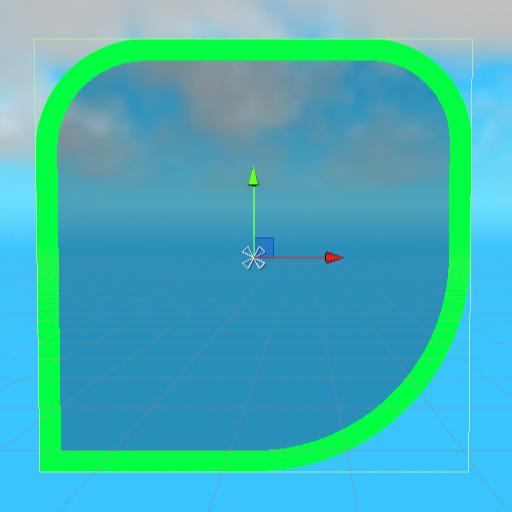
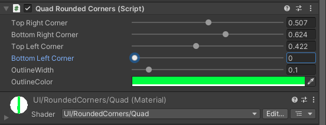
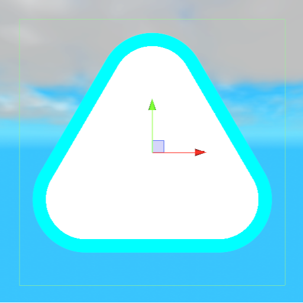
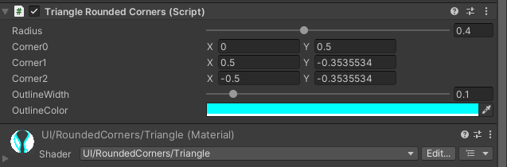
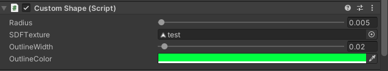
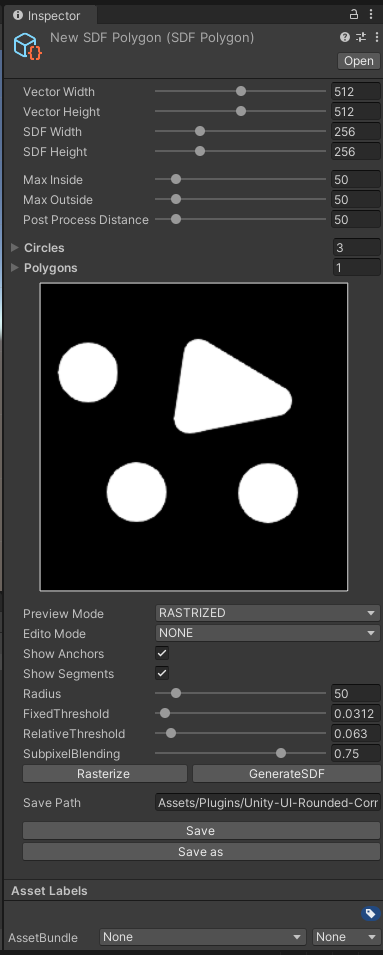

# Unity-UI-Rounded-Corners-Extention
This is an extension plugin that works based on [Unity-UI-Rounded-Corners](https://github.com/kirevdokimov/Unity-UI-Rounded-Corners) created by [kirevdokimov](https://github.com/kirevdokimov).  
You can add outlines to existing UI elements and the ability to convert polygons created in the editor to SDF texture.  

## Video
[Here is a demonstration video](https://youtu.be/poQhoVtyI5Y)

## Screenshot
Outlined UI elements  
</img>  
</img>  
</img>  
</img>  
</img>  
</img>  
Editor for creating Custom Shapes  
  

## Requirements
- [Unity-UI-Rounded-Corners](https://github.com/kirevdokimov/Unity-UI-Rounded-Corners)
	- This plugin is designed as derivative of this repository.
- [SDF Toolkit](https://assetstore.unity.com/packages/tools/utilities/sdf-toolkit-free-50191?locale=ja-JP)
	- This library is used to convert polygon rasterized texture to SDF texture.

## Install
1. Add [Unity-UI-Rounded-Corners](https://github.com/kirevdokimov/Unity-UI-Rounded-Corners) to your Unity project from the package manager.
2. Add [SDF Toolkit](https://assetstore.unity.com/packages/tools/utilities/sdf-toolkit-free-50191?locale=ja-JP) to your Unity project from asset store.
3. Clone this repository with the following command
```
git clone https://github.com/TLabAltoh/Unityr-UI-Rounded-Corners-Extension.git
```
4. Place the cloned repository under the Asset directory of the Unity project.

## Create SDF Texture
Select Create ---> SDF Polygon to add a Scriptable Object to the asset. For detailed instructions, please refer to [this video](https://youtu.be/poQhoVtyI5Y)

## Fxaa Support
When creating a Custom Shape, Fxaa is used to reduce aliasing at the boundaries.  
[refarence](https://catlikecoding.com/unity/tutorials/custom-srp/fxaa/)

## Lisence
This repository is MIT licensed.
