</img>

# Unity-SDF-UI-Toolkit
This Unity plugin provides a UI component and utility for rendering UI graphics with features such as outlines, shadows, and rounded corners using signed distance functions (SDF). It supports a variety of simple shapes (e.g., quads, triangles, circles) as well as more complex shapes (currently splines and SDF textures). Additionally, the utility includes an SDF texture painter that allows for editing Bezier curves within the Unity editor and converting them to SDF textures.

## Screenshot
<table>
    <caption>Overview</caption>
    <tr>
        <td>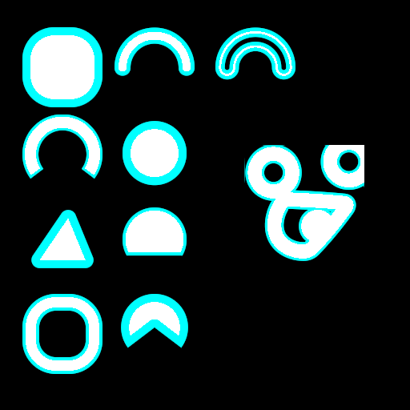</img>  </td>
    </tr>
</table>
<table>
    <tr>
        <td>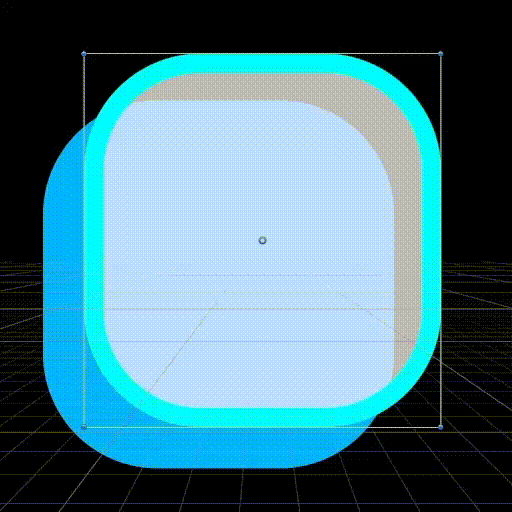</td>
        <td>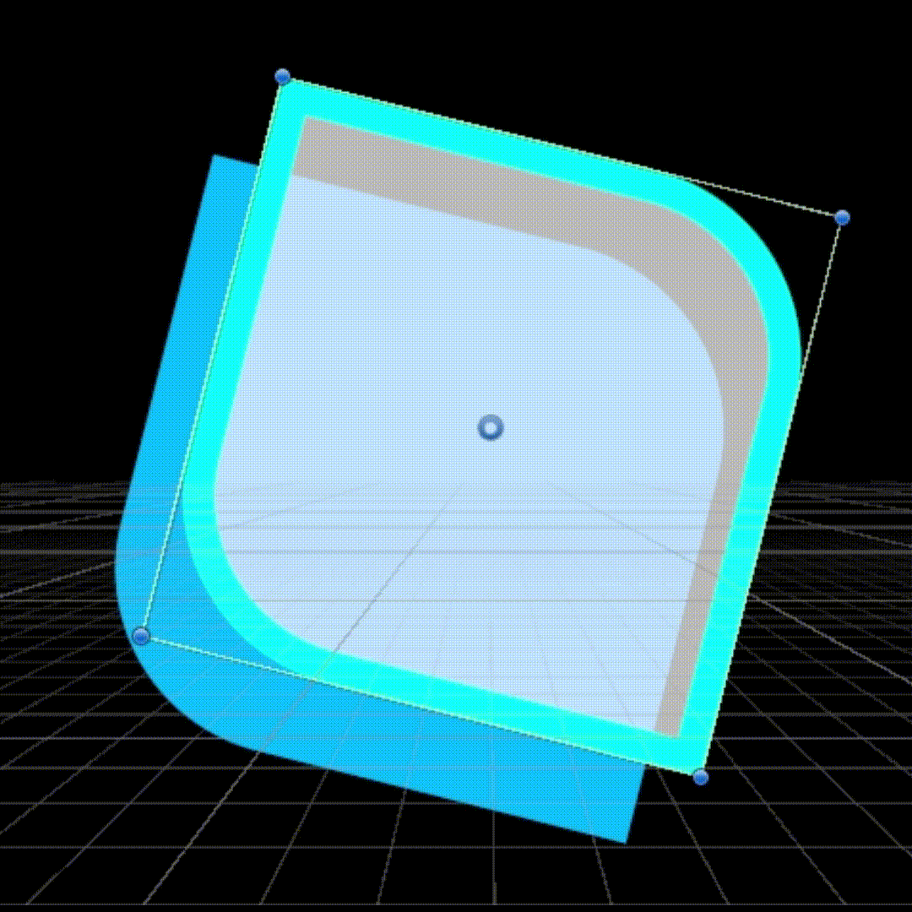</td>
        <td></td>
        <td>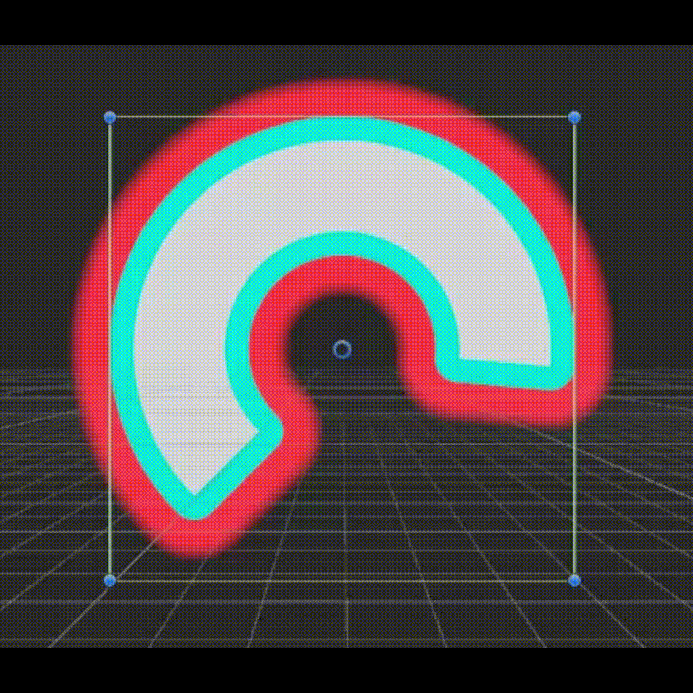</td>
        <td>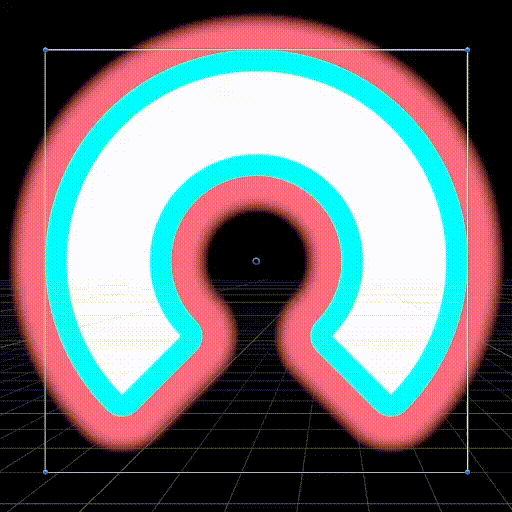</td>
    </tr>
</table>
<table>
    <tr>
        <td></td>
        <td>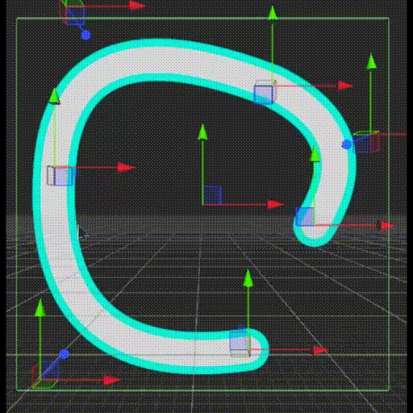</td>
        <td>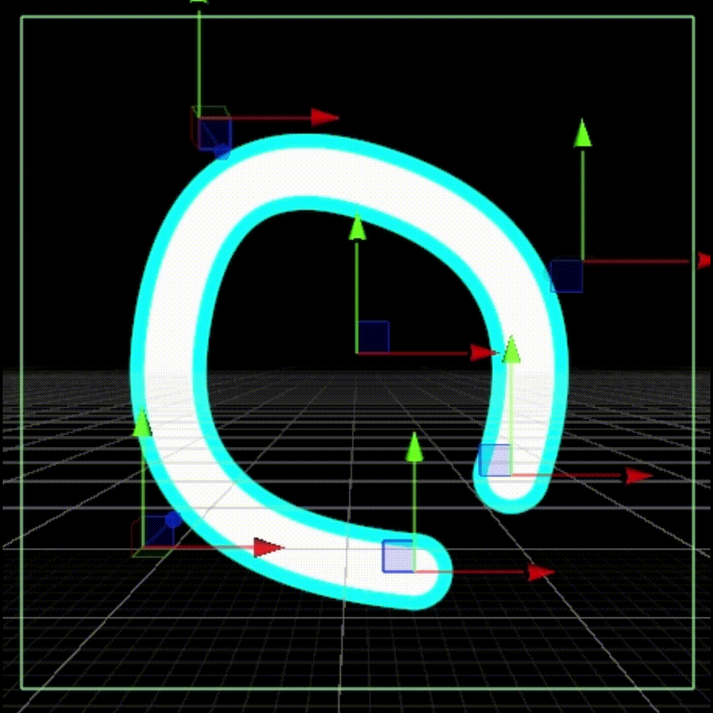</td>
    </tr>
</table>
<table>
    <caption>Additional UI Effect (Shiny and SDF Tex Pattern)</caption>
    <tr>
        <td>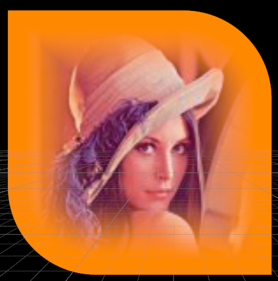</td>
        <td>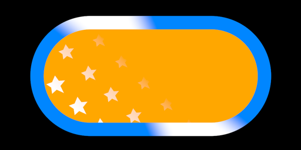</td>
    </tr>
</table>
<table>
    <caption>Squircle (left: Basic, right: approximate (lightweight) version)</caption>
    <tr>
        <td>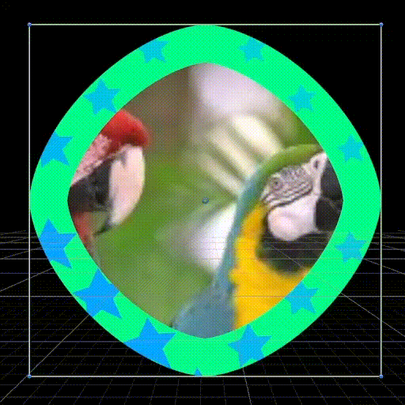</td>
        <td>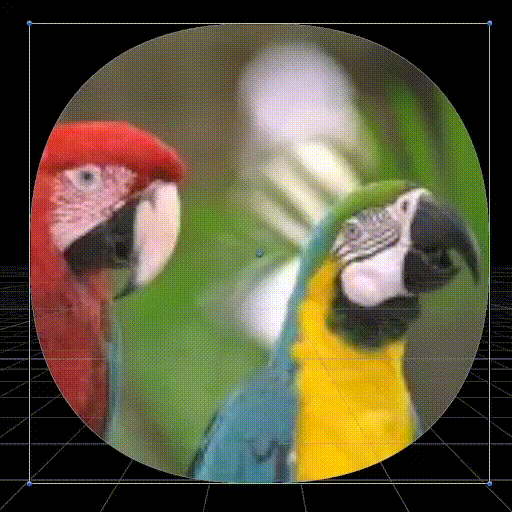</td>
    </tr>
</table>
<table>
    <caption>Gradation (Linear, Radial, Conical)</caption>
    <tr>
        <td>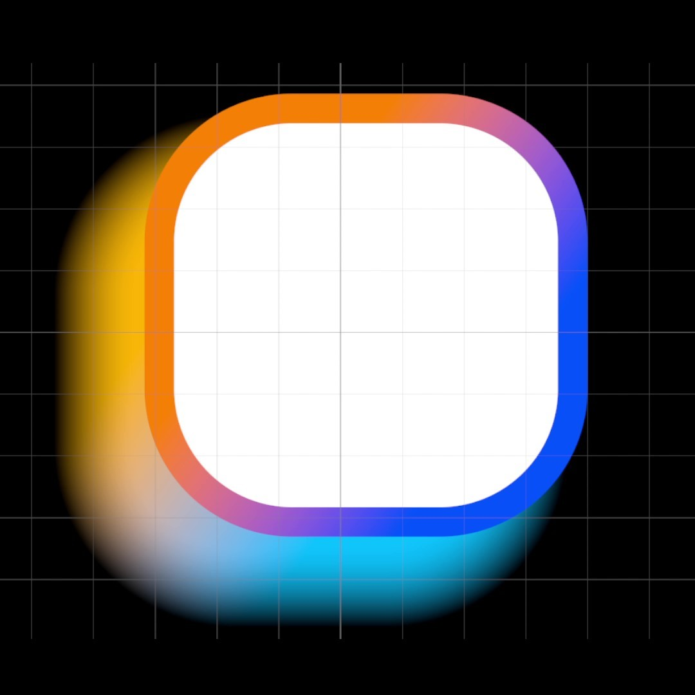</td>
        <td>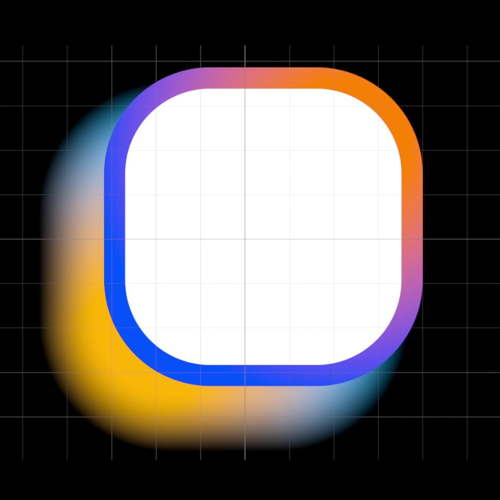</td>
        <td>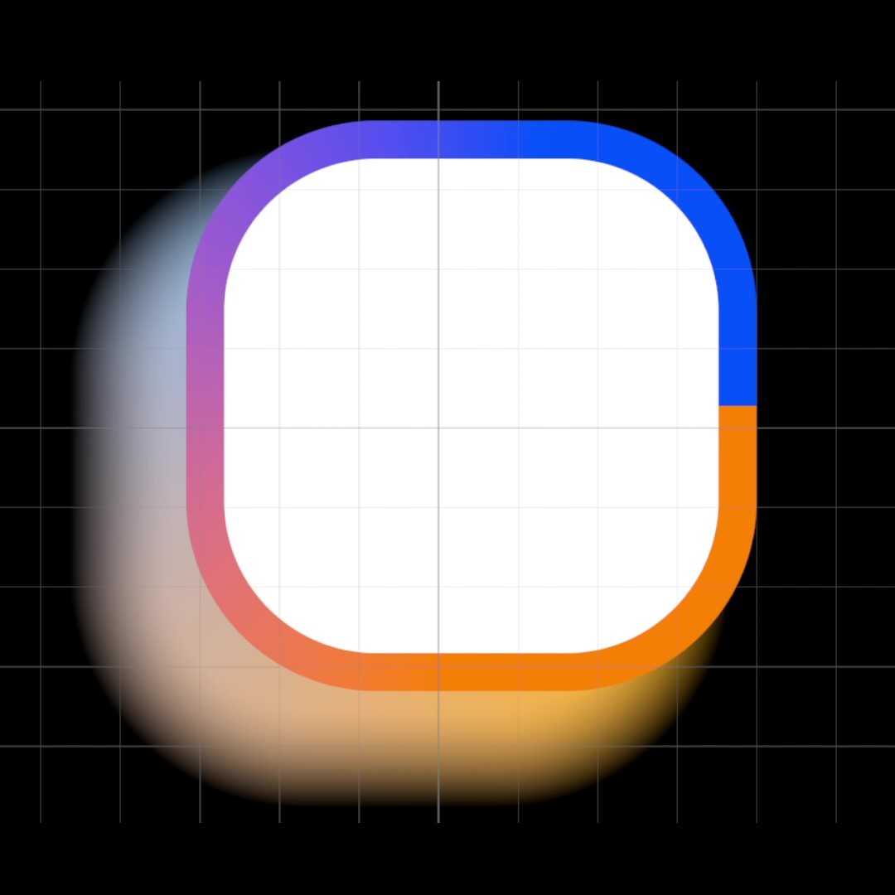</td>
    </tr>
</table>

<table>
    <caption>Rainbow Gradation Effect (works with any gradation)</br>This feature was implemented thanks to <a href="https://github.com/tomgiagtz">tomgiagtz</a></caption>
    <tr>
        <td>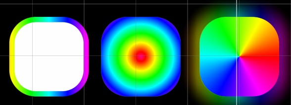</td>
    </tr>
    
    
</table>
<table>
    <caption>Editor for creating Custom Shapes</caption>
    <tr>
        <td>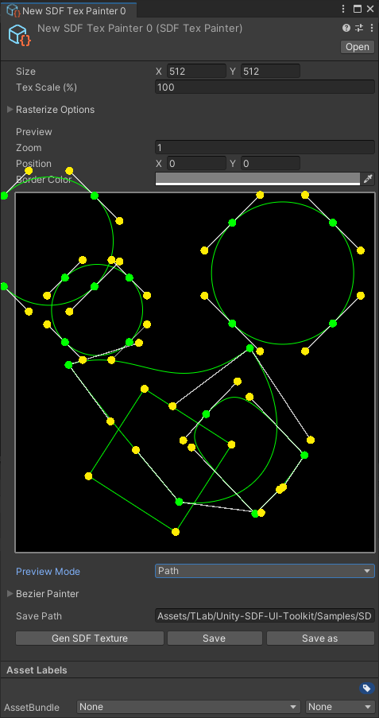</td>
        <td>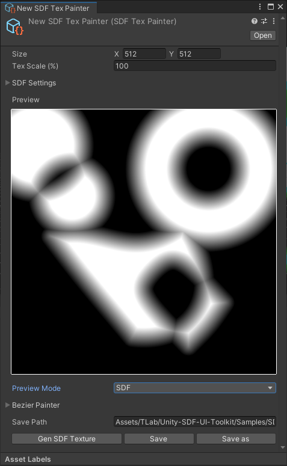</td>
    </tr>
</table>

## Requirement
- [com.unity.burst](https://docs.unity3d.com/2021.1/Documentation/Manual/com.unity.burst.html)
- [com.unity.mathematics](https://docs.unity3d.com/2021.3/Documentation/Manual/com.unity.mathematics.html)
- [com.unity.nuget.newtonsoft-json](https://docs.unity3d.com/Packages/com.unity.nuget.newtonsoft-json@3.0/manual/index.html)

## Install
### Git
Clone this repository with the following command
```
git clone https://github.com/TLabAltoh/Unity-SDF-UI-Toolkit.git
```

or

```
git submodule add https://github.com/TLabAltoh/Unity-SDF-UI-Toolkit.git
```
### Unity Package Manager
add package from git URL ...
```
https://github.com/TLabAltoh/Unity-SDF-UI-Toolkit.git#upm
```

### Setup
- Enable ```CachingPreprocesser``` in ```ProjectSettins/Editor/ShaderCompilation```
- Set the ```ColorSpace``` to ```Linear``` in ```ProjectSettins/Player/OtherSettings/Rendering``` (if ```Gamma``` is selected, the HDR color will appear little different).

## Feature
### Vector UI
Vector UI offers advantages in quality and dynamic UI creation. This plugin includes the ```SDFUI``` class, and most of the main components inherit from it. Additionally, most ```SDFUI``` components render graphics as Vector UI using signed distance functions.

> [!NOTE]  
> ```SDFSpline``` is not supported in [WebGL](https://docs.unity3d.com/Manual/webgl.html) platform because ```SDFSpline``` uses [```StructuredBuffer```](https://docs.unity3d.com/ScriptReference/GraphicsBuffer.Target.Structured.html) and WebGL doesn't support it.

<details><summary>How to set the default option of SDFUI</summary>

Please open ```SDFUISettings``` from ```TLab\UI\SDF\Settings```.

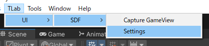</img>  

Here you can set the default value of ```SFUUI```.

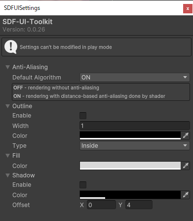</img>

This feature was implemented thanks to [AAAYaKo](https://github.com/AAAYaKo).

</details>

### Batch rendering
To optimise performance, this plugin will batch-render ```SDFUI```s that have the same properties. This feature was implemented thanks to [AAAYaKo](https://github.com/AAAYaKo).

### SDF Texture Painter
If the shape is complex (like an ```SDFSpline```, which might be the only one at the moment), it can significantly impact performance. If you want to use a complex shape while considering app performance, replacing the current shape with an ```SDFTex``` might be more efficient. The ```SDF Tex Painter``` has the ability to edit cubic Bezier curves and convert them to SDF textures (```Texture2D```).

#### How to make a new one
Select ```Create/TLab/UI/SDF/SDF Tex Painter```

#### How to Edit a Bezier Path
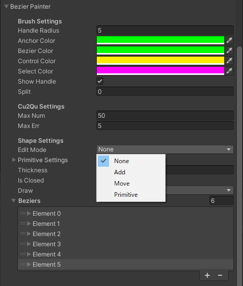</img>  

##### Common

- ```Shift``` + ```Left Click```: Select Anchor Handles
- ```Shift``` + ```Ctrl``` + ```Left Click```: Select all Handles of the Bezier segment
- ```G```: Move selected handles
- ```R```: Rotate selected handles
- ```S```: Scale selected handles
- ```Right Click```: Deselect Anchor Handles or Cancel Editing
- ```Delete```: Delete Selected Handle

##### EditMode "Move"
- ```Left Click``` + ```Mouse Drag```: Move Anchor Handle
- ```Ctrl``` + ```Left Click``` + ```Mouse Drag```: Move Control Handle

##### EditMode "Add"
- ```Left Click```: Add new Bezier Handle

##### EditMode "Primitive"
- ```Left Click```: Add new Bezier Primitive (```Circle``` or ```Box```)

#### Implementation Approach
##### Cu2Qu
It is difficult to calculate distance from cubic Bezier mathematically.  So ```SDF Text Painter``` converts the cubic Bezier curve to a quadratic Bezier curve based on [this code](https://github.com/googlefonts/cu2qu). 

## Lisence
This repository is MIT licensed.

## References
- [Unity-UI-Rounded-Corners](https://github.com/kirevdokimov/Unity-UI-Rounded-Corners) created by [kirevdokimov](https://github.com/kirevdokimov)
- [Unity-UI-SDF](https://github.com/BlenMiner/Unity-UI-SDF) created by [BlenMiner](https://github.com/BlenMiner)
- [distfunctions2d](https://iquilezles.org/articles/distfunctions2d/)
